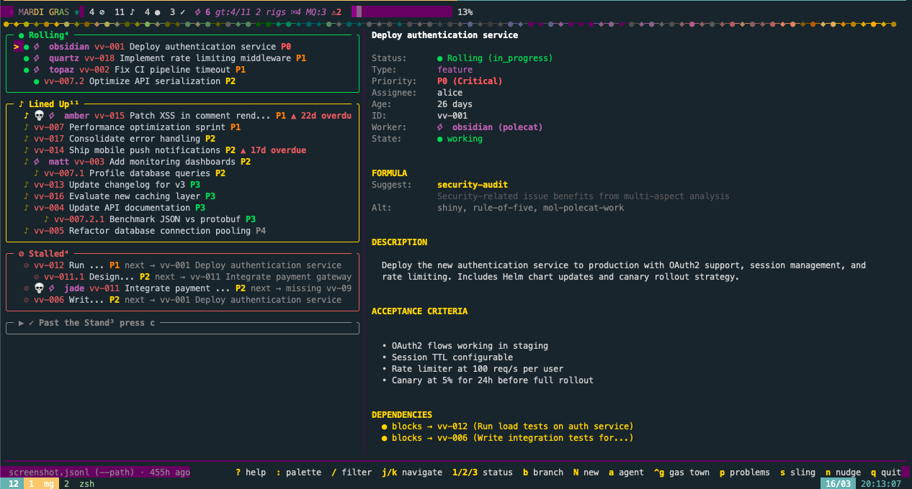

# ⚜ Mardi Gras

**Your Beads issues deserve a parade — not a spreadsheet.**

Mardi Gras is a terminal UI for [Beads](https://github.com/steveyegge/beads) that turns your issue list into a living parade: what's moving, what's waiting, what's blocked, and what's already behind you.

It's fast, visual, and joyful.
One binary. No config. Just `mg`.



Think of your project as a parade route:

```
Rolling      →  work in progress
Lined Up     →  open & ready
Stalled      →  blocked
Past Stand   →  done
```

Same data. Better vibe.

## Why this exists

Beads solves agent context beautifully.
But `bd list` wasn't built for humans doing daily visual triage.

People have tried to fix this: web dashboards, desktop apps, alternate TUIs. Most recreate a kanban board.

Mardi Gras doesn't.

It treats your work like motion. Because work _is_ motion. Things move. Things wait. Things get stuck. Things pass.

If you're going to stare at your tasks every day, they should at least make you smile.

## Install

### Homebrew (macOS / Linux)

```bash
brew install matt-wright86/homebrew-tap/mardi-gras
```

### Go

```bash
go install github.com/matt-wright86/mardi-gras/cmd/mg@latest
```

> **Note**: Make sure `~/go/bin` is on your `PATH`. macOS ships a `/usr/bin/mg` (micro-emacs) that will shadow the binary otherwise.

### From source

```bash
git clone https://github.com/matt-wright86/mardi-gras.git
cd mardi-gras
make build
```

### GitHub Releases

Pre-built binaries for Linux, macOS, and Windows are available on the [Releases](https://github.com/matt-wright86/mardi-gras/releases) page.

## Usage

```bash
# Auto-detect .beads/issues.jsonl in current directory
mg

# Point at a specific project
mg --path /path/to/.beads/issues.jsonl

# Treat additional dependency types as blockers
mg --block-types blocks,discovered-from
# or via environment variable
MG_BLOCK_TYPES=blocks,parent-child mg

# Check version
mg --version
```

Mardi Gras reads your `.beads/issues.jsonl` directly — no daemon, no database, no config file. It polls for changes automatically, so if an agent updates an issue while you're watching, the parade reshuffles in real time.

## Live Updates

Mardi Gras polls your JSONL file on a short interval. No OS-specific file watchers. No daemons. No background services.

- External edits (agents, scripts, `bd` commands) are picked up automatically.
- Current view state is preserved on refresh where possible (selection, closed section toggle, active filter query).
- The footer shows your data source and how fresh it is.

## Keybindings

| Key       | Action                                                                   |
| --------- | ------------------------------------------------------------------------ |
| `?`       | Toggle help overlay                                                      |
| `j` / `k` | Navigate up/down                                                         |
| `/`       | Enter filter mode                                                        |
| `esc`     | Clear filter (in filter mode) / Back to parade pane / Close help overlay |
| `enter`   | Apply filter (in filter mode) / Focus detail pane                        |
| `tab`     | Switch between parade and detail panes                                   |
| `c`       | Toggle closed issues                                                     |
| `a`       | Launch Claude Code agent on selected issue                               |
| `g` / `G` | Jump to top / bottom                                                     |
| `q`       | Quit (or close help overlay if open)                                     |
| `ctrl+c`  | Quit (global)                                                            |

Press `?` from anywhere (including while filtering) to open the full command reference overlay.

## Filtering

Press `/` and the bottom bar becomes a query input.

- `enter`: keep the query applied and return to list navigation.
- `esc`: clear the query and exit filter mode.
- Multiple terms use `AND` semantics (all terms must match).

Supported query forms:

- Free text: `deploy auth` (matches issue ID and title)
- Type token: `type:bug`, `type:feature`, `type:task`, `type:chore`, `type:epic`
- Priority shorthand: `p0` to `p4`
- Priority token: `priority:0` to `priority:4`, or `priority:critical|high|medium|low|backlog`

Examples:

```text
type:feature p1 deploy
priority:high auth
type:feature p0 auth deploy     ← matches P0 features containing "auth" AND "deploy"
vv-006
```

## The Parade

Every Beads issue maps to a spot on the parade route:

| On the Route         | What It Means                         |
| -------------------- | ------------------------------------- |
| **Rolling** ●        | In progress — the float is moving     |
| **Lined Up** ♪       | Open and unblocked — waiting its turn |
| **Stalled** ⊘        | Blocked by a dependency               |
| **Past the Stand** ✓ | Done — beads have been thrown         |

Closed issues are collapsed by default (because in any real project, 90%+ of your issues are closed). Press `c` to expand them.

Stalled issues show a "next blocker" hint so you can see at a glance what's holding things up. The detail panel breaks dependencies into four categories: waiting on (active blockers), missing (dangling references), resolved (closed blockers), and related (non-blocking dependency types).

## tmux Integration

### Status Line Widget

Show parade counts directly in your tmux status bar:

```bash
set -g status-right "#(mg --status)"
```

This outputs a compact, color-coded summary: rolling, lined up, stalled, and closed counts. The `--path` and `--block-types` flags work here too, so you can point at a specific project:

```bash
set -g status-right "#(mg --status --path ~/myproject/.beads/issues.jsonl)"
```

### Popup Dashboard

Launch the full TUI in a tmux popup with a single keybinding:

```bash
bind m display-popup -E -w 80% -h 75% -d "#{pane_current_path}" "mg"
```

- `-E` closes the popup when `mg` exits
- `-w 80% -h 75%` sizes the popup relative to the terminal
- `-d "#{pane_current_path}"` preserves the working directory so `mg` auto-detects the right `.beads/issues.jsonl`

## Claude Code Integration

Press `a` on any selected issue to launch an interactive [Claude Code](https://claude.com/claude-code) session pre-loaded with the full issue context: title, description, notes, acceptance criteria, and dependency status.

The TUI suspends while Claude runs (using BubbleTea's `tea.ExecProcess`), giving Claude the full terminal. When you exit the Claude session, Mardi Gras resumes and reloads the JSONL to pick up any changes Claude made.

- Requires `claude` on your `PATH`
- If `claude` is not installed, the `a` key silently does nothing
- The prompt includes `bd update` and `bd close` hints so Claude knows how to manage the issue lifecycle

## Built with

- [BubbleTea](https://github.com/charmbracelet/bubbletea) — Elm Architecture for the terminal
- [Lipgloss](https://github.com/charmbracelet/lipgloss) — CSS-like styling (the purple, gold, and green)
- [Bubbles](https://github.com/charmbracelet/bubbles) — viewport scrolling

Single binary, no runtime dependencies. Cross-compiles to Linux, macOS, and Windows via [GoReleaser](https://goreleaser.com).

## Design Principles

- Joy over minimalism
- Motion over columns
- Zero configuration
- Human-first visuals
- Beads remains the brain

## What Mardi Gras is not

- Not a project management system
- Not a kanban replacement
- Not a sync layer

It is a visual lens on top of Beads. Beads remains the source of truth.

## Possible Future Ideas

- Color themes (Catppuccin, Dracula)
- Dependency graph view (ASCII DAG)
- Bead throw celebration animation on task close

No promises. Just dreams. PRs welcome.

## Contributing

Mardi Gras is early. The parade route is laid, the floats are rolling, but there's plenty of room for more krewes. See [CONTRIBUTING.md](CONTRIBUTING.md) for setup and guidelines.

## License

[MIT](LICENSE)

---

_Let the good tasks roll._ ⚜
