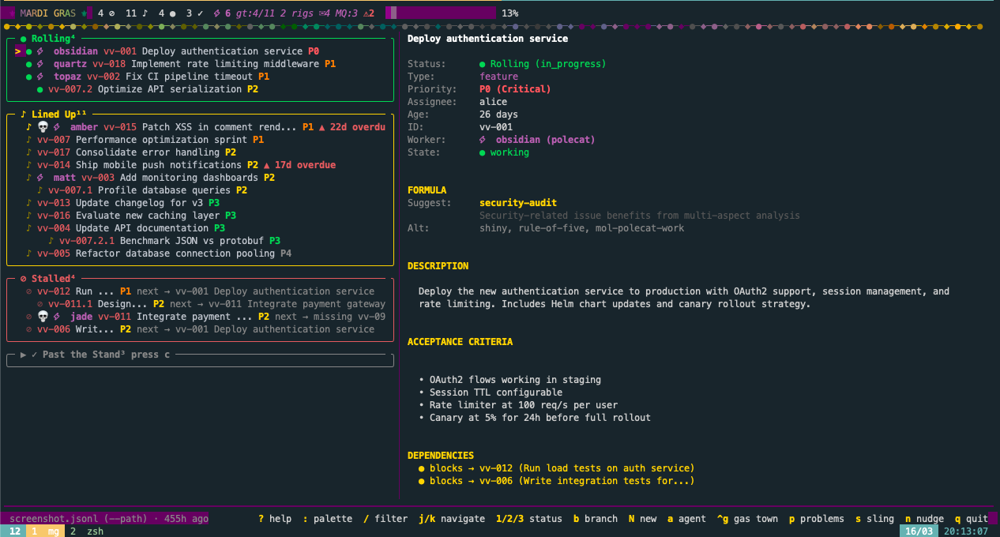

# ⚜ Mardi Gras

[](https://github.com/quietpublish/mardi-gras/actions/workflows/ci.yml)
[](https://github.com/quietpublish/mardi-gras/releases/latest)
[](https://go.dev/)
[](https://github.com/steveyegge/beads)
[](https://github.com/steveyegge/gastown)
[](LICENSE)
[](https://codecov.io/gh/quietpublish/mardi-gras)

**Your Beads issues deserve a parade — not a spreadsheet.**

Mardi Gras is a terminal UI for [Beads](https://github.com/steveyegge/beads) that turns your issue list into a living parade: what's moving, what's waiting, what's blocked, and what's already behind you.

It's fast, visual, and joyful.
One binary. No config. Just `mg`.

<!-- Screenshot: run `make screenshot` and resize to ~120x38 for best results -->


Think of your project as a parade route:

```
Rolling      →  work in progress
Lined Up     →  open & ready
Stalled      →  blocked
Past Stand   →  done
```

Same data. Better vibe.

## Why this exists

Beads solves agent context beautifully.
But `bd list` wasn't built for humans doing daily visual triage.

People have tried to fix this: web dashboards, desktop apps, alternate TUIs. Most recreate a kanban board.

Mardi Gras doesn't.

It treats your work like motion. Because work _is_ motion. Things move. Things wait. Things get stuck. Things pass.

If you're going to stare at your tasks every day, they should at least make you smile.

## Install

### Homebrew (macOS / Linux)

```bash
brew install matt-wright86/homebrew-tap/mardi-gras
```

### Go

```bash
go install github.com/matt-wright86/mardi-gras/cmd/mg@latest
```

> **Note**: Make sure `~/go/bin` is on your `PATH`. macOS ships a `/usr/bin/mg` (micro-emacs) that will shadow the binary otherwise.

### From source

```bash
git clone https://github.com/quietpublish/mardi-gras.git
cd mardi-gras
make build
```

### GitHub Releases

Pre-built binaries for Linux, macOS, and Windows are available on the [Releases](https://github.com/quietpublish/mardi-gras/releases) page.

## Usage

```bash
# Auto-detect data source in current directory
mg

# Point at a specific JSONL file
mg --path /path/to/.beads/issues.jsonl

# Treat additional dependency types as blockers
mg --block-types blocks,conditional-blocks,discovered-from
# or via environment variable
MG_BLOCK_TYPES=blocks,conditional-blocks,parent-child mg

# Disable animations (useful over SSH)
mg --no-animations
# or via environment variable
MG_NO_ANIMATIONS=1 mg

# Scale command timeouts for slow connections (default 30s, max 300s)
mg --cmd-timeout 60

# Check version
mg --version

# Enable debug logging (creates mg-debug.log in cwd)
MG_DEBUG=1 mg
```

Mardi Gras auto-detects your data source — no daemon, no config file. It supports two modes:

- **CLI mode** (preferred): uses `bd list --json` when `bd` is on PATH (Beads v0.60+)
- **JSONL mode** (legacy): reads `.beads/issues.jsonl` directly (walks up directories to find it)

Both modes poll for changes automatically, so if an agent updates an issue while you're watching, the parade reshuffles in real time. The `--path` flag forces JSONL mode for a specific file. The default blocking types are `blocks` and `conditional-blocks`.

## Live Updates

Mardi Gras polls for changes on a short interval. No OS-specific file watchers. No daemons. No background services.

- **CLI mode**: runs `bd list --json` every 5 seconds
- **JSONL mode**: polls file modtime every 1.2 seconds (legacy)
- External edits (agents, scripts, `bd` commands) are picked up automatically
- Current view state is preserved on refresh (selection, closed section toggle, active filter query)
- The footer shows your data source, refresh age, and workspace identity (database/backend from `bd context`)

## Keybindings

Press `?` from anywhere to open the full help overlay. See the [full keybinding reference](docs/keybindings.md) for all shortcuts across the parade, detail pane, Gas Town panel, and problems view.

## Features

Issues are grouped into parade sections: **Rolling** (in progress), **Lined Up** (open), **Stalled** (blocked), and **Past the Stand** (done). Press `enter` for a full detail panel with dependencies, molecule DAGs, comments, and HOP quality ratings. Use `/` to filter by text, type, or priority. Press `:` to open the command palette.

See the [parade and filtering guide](docs/filtering.md) for the full breakdown of sections, the detail panel, filtering syntax, and the command palette.

## Agent Integration

Press `a` to launch an AI agent on any issue. Supports [Claude Code](https://claude.com/claude-code) and [Cursor](https://cursor.com), with tmux-native multi-agent dispatch when running inside tmux.

See the [agent integration guide](docs/agents.md) for runtime detection, tmux dispatch, and requirements.

## Gas Town Integration

When [Gas Town](https://github.com/steveyegge/gastown) (`gt`) is on your PATH, Mardi Gras lights up with a full agent control surface: agent roster, convoys, mail, cost dashboards, and problem detection. Press `ctrl+g` to open the dashboard. Create issues and assign them to crew members in one step via the create form (`N`).

See the [Gas Town integration guide](docs/gastown.md) for the full feature set including sling, nudge, assign, convoys, and operational intelligence.

## tmux Integration

### Status Line Widget

Show parade counts directly in your tmux status bar:

```bash
set -g status-right "#(mg --status)"
```

This outputs a compact, color-coded summary: rolling, lined up, stalled, and closed counts. The `--path` and `--block-types` flags work here too, so you can point at a specific project:

```bash
set -g status-right "#(mg --status --path ~/myproject/.beads/issues.jsonl)"
```

### Popup Dashboard

Launch the full TUI in a tmux popup with a single keybinding:

```bash
bind m display-popup -E -w 80% -h 75% -d "#{pane_current_path}" "mg"
```

- `-E` closes the popup when `mg` exits
- `-w 80% -h 75%` sizes the popup relative to the terminal
- `-d "#{pane_current_path}"` preserves the working directory so `mg` auto-detects the right `.beads/issues.jsonl`

## Built with

- [BubbleTea v2](https://github.com/charmbracelet/bubbletea) — Elm Architecture for the terminal
- [Lipgloss v2](https://github.com/charmbracelet/lipgloss) — CSS-like styling (the purple, gold, and green)
- [Bubbles v2](https://github.com/charmbracelet/bubbles) — viewport scrolling

Single binary, no runtime dependencies. Cross-compiles to Linux, macOS, and Windows via [GoReleaser](https://goreleaser.com).

## Design Principles

- Joy over minimalism
- Motion over columns
- Zero configuration
- Human-first visuals
- Beads remains the brain

## What Mardi Gras is not

- Not a project management system
- Not a kanban replacement
- Not a sync layer

It is a visual lens on top of Beads. Beads remains the source of truth.

## Possible Future Ideas

- Color themes (Catppuccin, Dracula)
- Direct Dolt connection for sub-second polling
- Multi-runtime agent dispatch (Gemini CLI, Copilot CLI)

No promises. Just dreams. PRs welcome.

## Contributing

Mardi Gras is early. The parade route is laid, the floats are rolling, but there's plenty of room for more krewes. See [CONTRIBUTING.md](CONTRIBUTING.md) for setup and guidelines.

## License

[MIT](LICENSE)

---

_Let the good tasks roll._ ⚜
