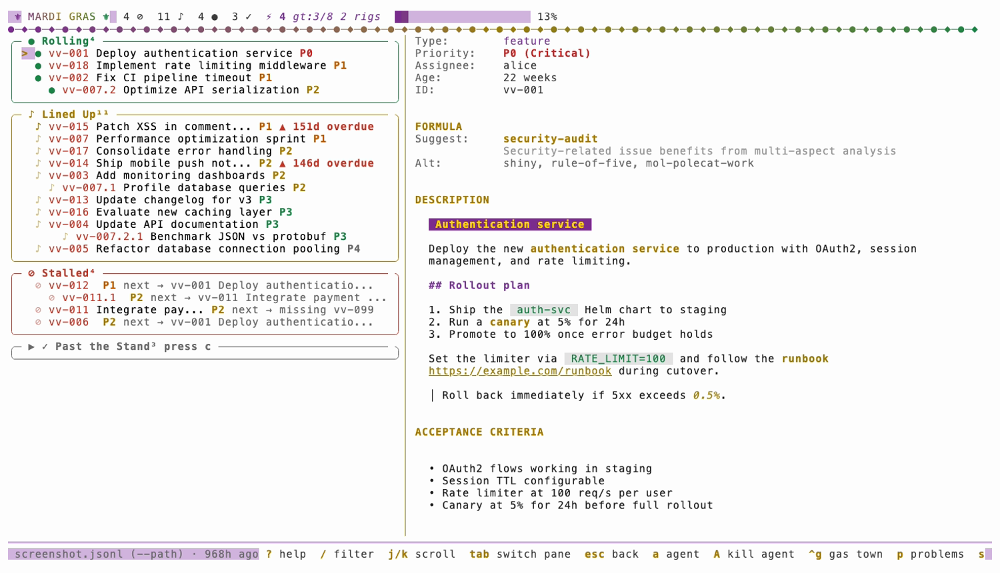

# ⚜ Mardi Gras

[](https://github.com/quietpublish/mardi-gras/actions/workflows/ci.yml)
[](https://github.com/quietpublish/mardi-gras/releases/latest)
[](https://go.dev/)
[](https://github.com/gastownhall/beads)
[](https://github.com/gastownhall/gastown)
[](https://github.com/gastownhall/gascity)
[](LICENSE)
[](https://codecov.io/gh/quietpublish/mardi-gras)

**Your Beads issues deserve a parade, not a spreadsheet.**

Mardi Gras (`mg`) is a terminal UI for [Beads](https://github.com/gastownhall/beads), the issue tracker built for coding agents. It reads the same issues your agents write and shows them as a parade: what's rolling, what's lined up, what's stalled, and what's already past the stand. When something changes, the parade reshuffles in front of you.

One static binary. No daemon, no config file. Run `mg` in a Beads project and you're watching.

<!-- Demo GIF: regenerate with `make demo-gif` (drives the fake Gas City supervisor via testdata/vhs/demo.tape) -->


## The parade

Every issue is on the route somewhere:

```
●  Rolling          in progress
♪  Lined Up         open, and nothing is in its way
⊘  Stalled          waiting on something that isn't done yet
✓  Past the Stand   closed, folded away until you press c
```

The route is honest. A stalled row names what it's waiting on. Children nest under their parents. Overdue work says so, in red. The header keeps a running tally and a progress bar, and the footer tells you where the data came from and how fresh it is.

Blocked is computed from dependency edges, not from a status field somebody forgot to update. `blocks` and `conditional-blocks` count by default; widen that with `--block-types` if your project uses others.

## Why this exists

Beads gives agents a durable memory of the work. `bd list` is fine for an agent. For a human doing morning triage, it's a wall of text.

The usual fix is a web dashboard or a kanban port. Mardi Gras takes a different view: work is motion. Things move, wait, get stuck, and pass. A parade shows that. Columns don't.

And if you're going to stare at your tasks every day, they should at least make you smile.

## Install

**Homebrew** (macOS and Linux)

```bash
brew install matt-wright86/homebrew-tap/mardi-gras
```

**Go**

```bash
go install github.com/matt-wright86/mardi-gras/cmd/mg@latest
```

> Make sure `~/go/bin` is on your `PATH` ahead of `/usr/bin`. macOS ships a `/usr/bin/mg` (micro-emacs) that will shadow the binary otherwise.

**Binaries** for Linux, macOS, and Windows on amd64 and arm64 are on the [Releases](https://github.com/quietpublish/mardi-gras/releases) page.

**From source**

```bash
git clone https://github.com/quietpublish/mardi-gras.git
cd mardi-gras
make build      # → ./mg
```

You need a Beads project. With `bd` on your `PATH`, mg talks to it directly. Without it, mg falls back to reading `.beads/issues.jsonl`.

## Sixty seconds in

```bash
cd your-project
mg
```

| Key | What happens |
| --- | --- |
| `j` / `k` | Move along the route |
| `enter` | Open the detail pane for the selected issue |
| `/` | Filter: free text, plus `type:bug`, `priority:high`, `label:backend` |
| `f` | Focus mode: your work and the top priorities, nothing else |
| `c` | Fold or unfold Past the Stand |
| `:` or `ctrl+k` | Command palette, with everything mg can do |
| `?` | Help overlay, paged by section |
| `q` | Leave the parade |

Press `?` for the rest. The [full keybinding reference](docs/keybindings.md) lists every shortcut across the parade, detail pane, orchestrator panel, and overlays.

## What you can do

### Read

The detail pane renders an issue's description, design notes, and acceptance criteria as real markdown. It shows dependencies in both directions, an epic's progress through its children, comments and the timeline, how old the issue is, and when work on it started. With an orchestrator attached it also suggests a formula for the work and, on Gas Town, draws the molecule DAG with the critical path picked out.

### Act

Writes go through the `bd` CLI, so anything mg changes is exactly what an agent would see.

- `1` `2` `3` set status; `!` `@` `#` `$` set priority.
- `N` creates an issue, `e` edits it, `r` adds a comment, `y` assigns it, `t` labels it, `l` links a dependency.
- `b` copies a branch name for the issue; `B` creates and checks out that branch.
- `space` builds a multi-selection; the status and priority keys then apply to all of it.
- `3` on a single issue closes it and claims the next ready issue in one step.
- `D` opens a `bd doctor` overlay when something about the workspace looks off.

### Launch agents

`a` starts an AI coding agent on the selected issue. [Claude Code](https://claude.com/claude-code), [Cursor](https://cursor.com), and [OpenAI Codex](https://github.com/openai/codex) are supported; mg picks the first one on your `PATH`, or you choose with `--agent`.

Inside tmux, the agent opens in a split pane beside the parade and mg remembers which pane belongs to which issue, so `a` again takes you back to it instead of starting a second one. `A` stops it.

`M` opens a live Codex transcript in place of the detail pane. mg speaks Codex's MCP protocol directly, streams messages, commands, and patches as they happen, and surfaces exec and patch approvals as a modal you answer without leaving the parade. `r` sends a follow-up prompt into the running session.

See the [agent integration guide](docs/agents.md) for runtime detection, tmux dispatch, and Codex specifics.

### Orchestrate

When an orchestrator is present, mg becomes a control surface for it. `ctrl+g` opens the panel: agent roster with live states, convoys, mail, cost dashboard, velocity, activity feed, and a problems view (`p`) that flags stalled agents, backoff loops, and zombie sessions. `a` slings the issue to an agent instead of opening a local one, `s` picks a formula first, `n` nudges the agent already on it, and `C` builds a convoy from an epic or a multi-selection.

Two backends are supported:

- **[Gas Town](https://github.com/gastownhall/gastown)** (`gt`), the default. Everything goes through the `gt` CLI.
- **[Gas City](https://github.com/gastownhall/gascity)** (`gc`), an orchestration-builder SDK from the same org. mg speaks its Supervisor HTTP API. Roster, mail, formulas, sling, assign, nudge, decommission, and convoys work; a few Gas Town-specific views don't, and mg hides those rather than failing.

mg picks a backend from evidence on the machine:

1. `MG_GC_API` is set → Gas City. You named it.
2. Any Gas Town evidence, a `GT_*` env var or `gt` on `PATH` → Gas Town.
3. No Gas Town evidence but Gas City evidence, `gc` on `PATH` or a `city.toml` up the tree → Gas City.
4. Nothing conclusive → Gas Town.

`MG_GC_API=auto` discovers the running supervisor; `MG_GC_CITY` pins which city to drive. The [Gas Town guide](docs/gastown.md) and [Gas City guide](docs/gascity.md) cover each feature set, and the Gas City guide includes the capability matrix.

## Options

```bash
mg                                      # auto-detect the Beads project you're in
mg --path ~/proj/.beads/issues.jsonl    # read a specific JSONL file
mg --block-types blocks,discovered-from # which dependency types count as blockers
mg --exclude-type epic,chore            # hide issue types from the parade
mg --exclude-label gt:agent             # hide issues carrying a label
mg --theme light                        # auto | dark | light
mg --agent codex                        # claude | cursor | codex
mg --cmd-timeout 60                     # seconds; scales every external command (default 30)
mg --no-animations                      # calm header, no confetti; good over SSH
mg --status                             # tmux status-line summary, then exit
mg --version
```

Every option has an environment variable so you can set it once: `MG_BLOCK_TYPES`, `MG_THEME`, `MG_AGENT_RUNTIME`, `MG_CMD_TIMEOUT`, `MG_NO_ANIMATIONS=1`. `MG_DEBUG=1` writes `mg-debug.log` in the current directory. `MG_GC_API` and `MG_GC_CITY` select the Gas City backend, as above.

## Live updates

mg polls. No file watchers, no daemon, no background service.

- With `bd` on `PATH`, it runs `bd list --json` every 5 seconds and checks the source's health every 15.
- Reading JSONL directly, it checks the file's modification time every 1.2 seconds.

Edits from agents, scripts, and `bd` commands all show up on the next tick. Your selection, filter, and fold state survive the refresh.

## Themes

mg ships a dark theme and a light one, and picks by asking the terminal for its background color. If your terminal doesn't answer, or you just want to be explicit, `--theme light` or `MG_THEME=light` settles it.



## tmux

**Status line.** A compact, color-coded count of rolling, lined up, stalled, and closed issues:

```bash
set -g status-right "#(mg --status)"
set -g status-right "#(mg --status --path ~/myproject/.beads/issues.jsonl)"   # a specific project
```

**Popup.** The whole parade on one key, sized to the terminal, in the current pane's directory:

```bash
bind m display-popup -E -w 80% -h 75% -d "#{pane_current_path}" "mg"
```

## Built with

[Bubble Tea v2](https://github.com/charmbracelet/bubbletea) for the Elm architecture, [Lip Gloss v2](https://github.com/charmbracelet/lipgloss) for the purple, gold, and green, [Bubbles v2](https://github.com/charmbracelet/bubbles) for the viewports, and [Glamour](https://github.com/charmbracelet/glamour) for the markdown. Single binary, no runtime dependencies, cross-compiled by [GoReleaser](https://goreleaser.com).

The [architecture overview](docs/ARCHITECTURE.md) explains how the pieces fit, including the driver seam that keeps orchestrators pluggable.

## What Mardi Gras is, and isn't

It is a lens on Beads. Beads stays the source of truth; mg never keeps state of its own, and everything it writes goes through `bd`.

It is not a project management system, not a kanban board, and not a sync layer. If you want those, Beads has an ecosystem. This is the part that makes you smile at 9am.

## Design principles

- Joy over minimalism
- Motion over columns
- Zero configuration
- Human-first visuals
- Beads remains the brain

## Contributing

The route is laid and the floats are rolling, but there's room for more krewes. [CONTRIBUTING.md](CONTRIBUTING.md) covers setup, the fake Gas Town and Gas City backends for local development, and conventions. Bug reports and PRs welcome.

## License

[MIT](LICENSE)

---

_Let the good tasks roll._ ⚜
